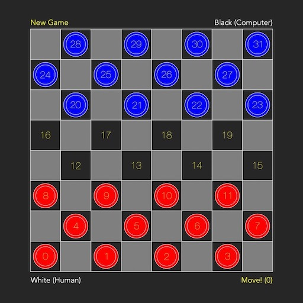

# Swift Checkers

### Description
Swift Checkers is a simple checkers game wirtten in Swift 4 for iOS, using [SpriteKit](https://developer.apple.com/spritekit/) and [GameplayKit](https://developer.apple.com/documentation/gameplaykit)

### Usage
* Tap on the **New Game** label to restart the game
* Press either **White** or **Black** player label to switch from **Human** to **Computer** player

